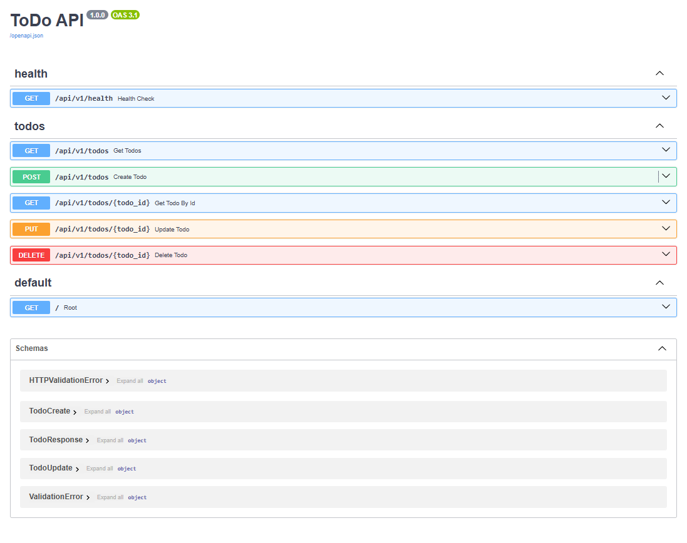

# Todo API

A production-inspired REST API for managing todo items, built with **FastAPI** and **Python**. Designed as a learning project to demonstrate professional backend architecture patterns applied to a simple, approachable domain.

---

## Table of Contents

- [Overview](#overview)
- [Project Structure](#project-structure)
- [Architecture](#architecture)
- [API Endpoints](#api-endpoints)
- [Schemas](#schemas)
- [Getting Started](#getting-started)
- [Running Tests](#running-tests)
- [Configuration](#configuration)

---

## Overview

This API provides full **CRUD** (Create, Read, Update, Delete) operations for todo items. Data is persisted to a local JSON file, making it easy to run without any database setup. The codebase is intentionally structured to mirror real-world production patterns — layered concerns, dependency injection, custom exception handling, request logging, and a comprehensive test suite.



**Tech Stack:**

| Tool | Purpose |
|---|---|
| FastAPI 0.138 | Web framework |
| Uvicorn 0.49 | ASGI server |
| Pydantic v2 | Data validation and serialization |
| pydantic-settings | Environment configuration |
| Pytest 9.1 | Testing framework |
| HTTPX | HTTP client for testing |

---

## Project Structure

```
app/
├── main.py                      # FastAPI app factory and entry point
│
├── api/
│   └── v1/
│       ├── router.py            # Combines all v1 route groups
│       └── routes/
│           ├── health.py        # GET /api/v1/health
│           └── todos.py         # Todo CRUD endpoints
│
├── core/
│   ├── config.py                # Settings loaded from .env (pydantic-settings)
│   ├── dependencies.py          # FastAPI dependency injection chain
│   ├── exception_handlers.py    # Maps custom exceptions to HTTP responses
│   ├── logging.py               # Logging configuration
│   └── middleware.py            # Request/response timing and logging
│
├── schemas/
│   └── todo.py                  # Pydantic models (request/response shapes)
│
├── services/
│   └── todo_service.py          # Business logic (UUID, timestamps, validation)
│
├── repositories/
│   └── todo_repository.py       # Data access layer (CRUD against storage)
│
├── storage/
│   └── json_storage.py          # JSON file read/write implementation
│
├── exceptions/
│   └── todo.py                  # TodoNotFoundError custom exception
│
├── data/
│   └── todo.json                # Persisted todo data
│
└── tests/
    ├── conftest.py              # Pytest fixtures
    ├── fakes.py                 # FakeTodoRepository for isolated unit tests
    ├── test_api.py              # API endpoint (integration) tests
    ├── test_service.py          # Service layer unit tests
    ├── test_repository.py       # Repository layer unit tests
    └── test_storage.py          # Storage layer tests
```

---

## Architecture

The app follows a **layered architecture** — each layer has a single responsibility and communicates only with the layer directly below it.

```
HTTP Request
     │
     ▼
  Routes          — Handle HTTP: parse input, return responses, set status codes
     │
     ▼
  Services        — Business logic: generate IDs, set timestamps, enforce rules
     │
     ▼
  Repositories    — Data access: read/write Pydantic models via storage
     │
     ▼
  Storage         — I/O implementation: reads and writes the JSON file
```

**Dependency injection** wires these layers together at runtime via FastAPI's `Depends()` system, defined in `core/dependencies.py`. This makes each layer independently testable — the test suite swaps the real repository for a `FakeTodoRepository` backed by an in-memory list.

---

## API Endpoints

Base URL prefix: `/api/v1`

### Health

| Method | Path | Description | Status |
|---|---|---|---|
| GET | `/api/v1/health` | Liveness check | 200 |

**Response:**
```json
{ "status": "healthy" }
```

---

### Todos

| Method | Path | Description | Success Status |
|---|---|---|---|
| GET | `/api/v1/todos` | List all todos | 200 |
| POST | `/api/v1/todos` | Create a new todo | 201 |
| GET | `/api/v1/todos/{todo_id}` | Get a todo by UUID | 200 |
| PUT | `/api/v1/todos/{todo_id}` | Update a todo (partial) | 200 |
| DELETE | `/api/v1/todos/{todo_id}` | Delete a todo | 204 |

#### Error Responses

| Scenario | Status | Body |
|---|---|---|
| Todo not found | 404 | `{"detail": "Todo with id '...' was not found."}` |
| Invalid UUID format | 422 | Pydantic validation error |
| Invalid request body | 422 | Pydantic validation error |

---

## Schemas

### `TodoCreate` (POST request body)

| Field | Type | Rules |
|---|---|---|
| `title` | `string` | Required, 3–100 characters |
| `description` | `string \| null` | Optional, max 500 characters |

### `TodoUpdate` (PUT request body)

All fields are optional — send only the fields you want to change.

| Field | Type |
|---|---|
| `title` | `string \| null` |
| `description` | `string \| null` |
| `completed` | `boolean \| null` |

### `TodoResponse`

| Field | Type |
|---|---|
| `id` | `UUID` |
| `title` | `string` |
| `description` | `string \| null` |
| `completed` | `boolean` |
| `created_at` | `datetime (UTC)` |
| `updated_at` | `datetime (UTC)` |

### `TodoListResponse`

| Field | Type |
|---|---|
| `total` | `integer` |
| `items` | `TodoResponse[]` |

---

## Getting Started

### Prerequisites

- Python 3.11+

### Installation

```bash
# Clone the repository
git clone <repo-url>
cd Fast_api

# Create and activate a virtual environment
python -m venv .venv
.venv\Scripts\Activate.ps1   # Windows PowerShell
# source .venv/bin/activate   # macOS/Linux

# Install dependencies
pip install -r requirements.txt
```

### Configuration

Copy `.env.example` to `.env` and adjust as needed:

```env
APP_NAME=ToDo API
APP_VERSION=1.0.0
DEBUG=True
DATA_FILE=app/data/todo.json
```

| Variable | Description | Default |
|---|---|---|
| `APP_NAME` | Name shown in API metadata | `ToDo API` |
| `APP_VERSION` | Version shown in API metadata | `1.0.0` |
| `DEBUG` | Enables debug mode | `True` |
| `DATA_FILE` | Path to the JSON data file | `app/data/todo.json` |

### Running the Server

```bash
uvicorn app.main:app --reload
```

The API will be available at `http://localhost:8000`.

Interactive docs are served automatically at:
- **Swagger UI:** `http://localhost:8000/docs`
- **ReDoc:** `http://localhost:8000/redoc`

---

## Running Tests

```bash
pytest
```

The test suite covers four layers:

| File | Layer | Approach |
|---|---|---|
| `test_api.py` | API (integration) | Real TestClient + real app |
| `test_service.py` | Service | FakeTodoRepository (in-memory) |
| `test_repository.py` | Repository | Real storage against a temp file |
| `test_storage.py` | Storage | Fixture validation |

Run with verbose output:

```bash
pytest -v
```

---

## License

See [LICENSE](LICENSE).
